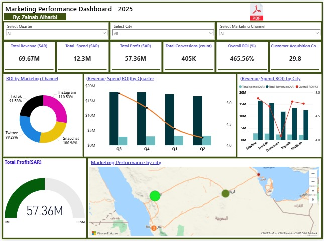

# 🚀 Marketing Campaign Performance Analysis (2025)

## 🌟 Overview & Key Metrics
This project delivers an end-to-end analysis of a large-scale e-commerce marketing campaign (500 campaigns over 4 quarters). The analysis, conducted using Python and visualized in Power BI, focuses on optimizing budget allocation and measuring efficiency.

### Key Results
* **Overall ROI:** **465.56%**
* **Total Profit:** **57.36 Million SAR**.
* **Total Conversions:** 405K.

## 🛠️ Tools and Technologies
* **Language:** Python 🐍 (Pandas, NumPy for data manipulation and calculation).
* **Data Visualization:** Python (Matplotlib, for preliminary charting and channel performance visuals) and Power BI 📊 (for the final dashboard and high-level reporting).
* **Environment:** JupyterLab.

## 📊 Power BI Dashboard Snapshot
The following dashboard provides a high-level summary of the campaign's performance, including channel breakdown and geographical analysis.

---

## 💻 Analysis Workflow (Python Notebook)
The full analysis is documented step-by-step in the accompanying Jupyter Notebook file. Key steps include:

### 1. Data Preparation & Cleaning
* Checked data quality and calculated core KPIs (ROI, CPA, CTR).

### 2. Detailed Segmentation Analysis
* **Channel Analysis:** Investigating performance of Snapchat, Instagram, TikTok, and Twitter.
* **Geographical Analysis:** Performance breakdown by cities (Medina, Riyadh, Jeddah, Dammam).
* **Demographic Analysis:** Insights based on Age, Gender, and Device type.

---

## 🔗 View Final Report & Files
* **[View Full Python Code Notebook Here] (https://github.com/zaaii-f/Marketing_Campaign_Performance_Analysis/blob/main/Marketing_Campaign_Performance_Analysis_2025-11.ipynb)** *
* **[View Interactive HTML Report] ( https://zaaii-f.github.io/Marketing_Campaign_Performance_Analysis/Marketing_Report.html)**

* **Data Analyst📉:** Zainab .. https://www.linkedin.com/in/zainab-alharbi-38aba733a?utm_source=share&utm_campaign=share_via&utm_content=profile&utm_medium=ios_app
